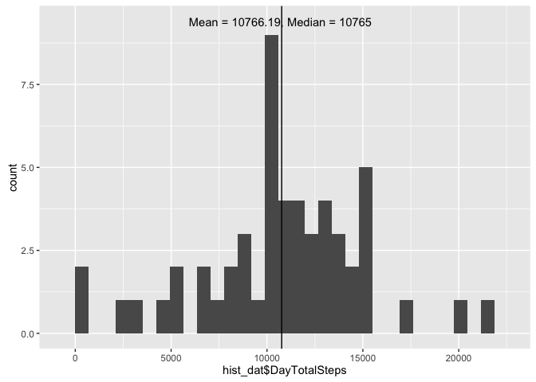
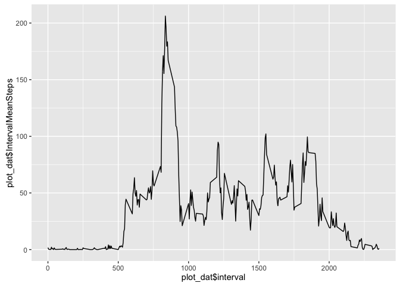

# Reproducible Research: Peer Assessment 1


## Loading and preprocessing the data

The following chunks of R code assume that the activity data set is unzipped as activity.csv in the present working directory.

```r
library(sqldf)
```

```
## Loading required package: gsubfn
```

```
## Loading required package: proto
```

```
## Warning in fun(libname, pkgname): couldn't connect to display "/private/
## tmp/com.apple.launchd.pah3aULeve/org.macosforge.xquartz:0"
```

```
## Loading required package: RSQLite
```

```
## Loading required package: DBI
```

```r
library(ggplot2)

dat <- read.csv("activity.csv")
```
## What is mean total number of steps taken per day?
### 1. Calculate the total number of steps taken per day
The mean total number of steps taken per day is 10766.19.

```r
sql_statement <- "SELECT 1.0 * SUM(DayTotalSteps)/COUNT(1) AS [Mean total number of steps taken per day] FROM (SELECT SUM(steps) as DayTotalSteps FROM dat WHERE steps NOT LIKE 'NA' GROUP BY date)"
MeanTotalStepsPerDay <- sqldf(sql_statement)
```

```
## Loading required package: tcltk
```
### 2. Make a histogram of the total number of steps taken each day
To further address this question, we construct a histogram of the total number of steps taken each day and report the mean and median of the total number of steps taken per day on the plot. This is exploratory, so we will leave the plot's "window dressing" for another time. (At that point, we'll also remove things like the hardcoded values.)

```r
sql_statement <- "SELECT SUM(steps) as DayTotalSteps FROM dat WHERE steps NOT LIKE 'NA' GROUP BY date"
hist_dat <- sqldf(sql_statement)

ggplot(data = hist_dat, aes(hist_dat$DayTotalSteps)) + geom_histogram() + geom_vline(xintercept = 10766.19) + annotate("text", x = 10700, y = 9.4, label = "Mean = 10766.19, Median = 10765")
```

```
## `stat_bin()` using `bins = 30`. Pick better value with `binwidth`.
```



### 3. Calculate and report the mean and median of the total number of steps taken per day
The mean of the total number of steps taken per day is 10766.19.

```r
MeanTotalStepsPerDay
```

```
##   Mean total number of steps taken per day
## 1                                 10766.19
```

The median of the total number of steps taken per day is 10765.

```r
median(hist_dat$DayTotalSteps)
```

```
## [1] 10765
```

## What is the average daily activity pattern?
For this section of the project, we continue to ignore NA values (since the following involves imputing those missing values). Again, plot "window dressing" is left for another time.

### 1. Make a time series plot (i.e. 𝚝𝚢𝚙𝚎 = "𝚕") of the 5-minute interval (x-axis) and the average number of steps taken, averaged across all days (y-axis)

```r
sql_statement <- "SELECT 1.0 * SUM(steps)/COUNT(1) AS [IntervalMeanSteps], interval FROM dat WHERE steps NOT LIKE 'NA' GROUP BY interval"
plot_dat <- sqldf(sql_statement)
ggplot(data = plot_dat, aes(x = plot_dat$interval, y = plot_dat$IntervalMeanSteps, group = 1)) + geom_line()
```



### 2. Which 5-minute interval, on average across all the days in the dataset, contains the maximum number of steps?
Interval 835 contains the maximum number of steps, on average across all the days in the dataset: 206.1698 steps.

```r
sql_statement <- "SELECT interval AS [Interval of Max Mean Steps], IntervalMeanSteps AS [Max Mean Steps] FROM plot_dat WHERE IntervalMeanSteps = (SELECT MAX(IntervalMeanSteps) from plot_dat)"
sqldf(sql_statement)
```

```
##   Interval of Max Mean Steps Max Mean Steps
## 1                        835       206.1698
```

## Imputing missing values
There are a number of days/intervals where there are missing values (coded as 𝙽𝙰). The presence of missing days may introduce bias into some calculations or summaries of the data.


## Are there differences in activity patterns between weekdays and weekends?
