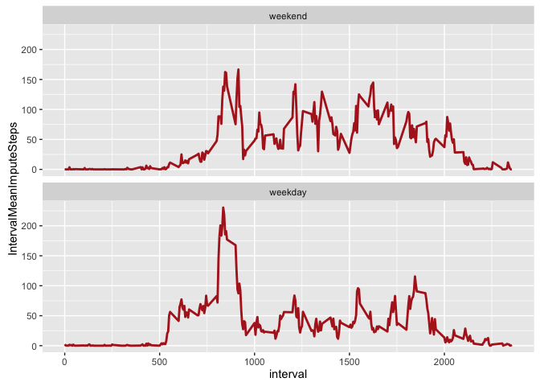

# Reproducible Research: Peer Assessment 1


## Loading and preprocessing the data

The following chunks of R code assume that the activity data set is unzipped as activity.csv in the present working directory.

```r
library(sqldf)
```

```
## Loading required package: gsubfn
```

```
## Loading required package: proto
```

```
## Warning in fun(libname, pkgname): couldn't connect to display "/private/
## tmp/com.apple.launchd.pah3aULeve/org.macosforge.xquartz:0"
```

```
## Loading required package: RSQLite
```

```
## Loading required package: DBI
```

```r
library(ggplot2)

dat <- read.csv("activity.csv")
```
## What is mean total number of steps taken per day?
### 1. Calculate the total number of steps taken per day
The mean total number of steps taken per day is 10766.19.

```r
sql_statement <- "SELECT 1.0 * SUM(DayTotalSteps)/COUNT(1) AS [Mean total number of steps taken per day] FROM (SELECT SUM(steps) as DayTotalSteps FROM dat WHERE steps IS NOT NULL GROUP BY date)"
MeanTotalStepsPerDay <- sqldf(sql_statement)
```

```
## Loading required package: tcltk
```
### 2. Make a histogram of the total number of steps taken each day
To further address this question, we construct a histogram of the total number of steps taken each day and report the mean and median of the total number of steps taken per day on the plot. This is exploratory, so we will leave the plot's "window dressing" for another time. (At that point, we'll also remove things like the hardcoded values.)

```r
sql_statement <- "SELECT SUM(steps) as DayTotalSteps FROM dat WHERE steps IS NOT NULL GROUP BY date"
hist_dat <- sqldf(sql_statement)

ggplot(data = hist_dat, aes(hist_dat$DayTotalSteps)) + geom_histogram() + geom_vline(xintercept = 10766.19) + annotate("text", x = 10700, y = 9.4, label = "Mean = 10766.19, Median = 10765")
```

```
## `stat_bin()` using `bins = 30`. Pick better value with `binwidth`.
```


### 3. Calculate and report the mean and median of the total number of steps taken per day
The mean of the total number of steps taken per day is 10766.19.

```r
MeanTotalStepsPerDay
```

```
##   Mean total number of steps taken per day
## 1                                 10766.19
```

The median of the total number of steps taken per day is 10765.

```r
median(hist_dat$DayTotalSteps)
```

```
## [1] 10765
```

## What is the average daily activity pattern?
For this section of the project, we continue to ignore NA values (since the following involves imputing those missing values). Again, plot "window dressing" is left for another time.

### 1. Make a time series plot (i.e. 𝚝𝚢𝚙𝚎 = "𝚕") of the 5-minute interval (x-axis) and the average number of steps taken, averaged across all days (y-axis)

```r
sql_statement <- "SELECT 1.0 * SUM(steps)/COUNT(1) AS [IntervalMeanSteps], interval FROM dat WHERE steps IS NOT NULL GROUP BY interval"
plot_dat <- sqldf(sql_statement)
ggplot(data = plot_dat, aes(x = plot_dat$interval, y = plot_dat$IntervalMeanSteps, group = 1)) + geom_line()
```


### 2. Which 5-minute interval, on average across all the days in the dataset, contains the maximum number of steps?
Interval 835 contains the maximum number of steps, on average, across all the days in the dataset: 206.1698 steps.

```r
sql_statement <- "SELECT interval AS [Interval of Max Mean Steps], IntervalMeanSteps AS [Max Mean Steps] FROM plot_dat WHERE IntervalMeanSteps = (SELECT MAX(IntervalMeanSteps) from plot_dat)"
sqldf(sql_statement)
```

```
##   Interval of Max Mean Steps Max Mean Steps
## 1                        835       206.1698
```

## Imputing missing values
There are a number of days/intervals where there are missing values (coded as 𝙽𝙰). The presence of missing days may introduce bias into some calculations or summaries of the data.

### 1. Calculate and report the total number of missing values in the dataset

```r
sql_statement <- "SELECT COUNT(1) AS [Number of NA Values] FROM dat WHERE steps IS NULL"
sqldf(sql_statement)
```

```
##   Number of NA Values
## 1                2304
```

### 2. Devise a strategy for filling in all of the missing values in the dataset
Here, we will use the suggested strategy of replacing NA values with the mean number of steps for the corresponding interval. The reason for this choice over replacing with a day's mean is that some days consist entirely of NA data points. In the future, we may use a function of surrounding time intervals to calculate a particular NA's replacement value.

```r
sql_statement <- "SELECT interval, 1.0 * SUM(steps)/COUNT(1) MeanSteps FROM dat WHERE steps IS NOT NULL GROUP BY interval"
IntervalMeanSteps <- sqldf(sql_statement)
```

### 3. Create a new dataset that is equal to the original dataset but with the missing data filled in

```r
sql_statement <- "SELECT CASE WHEN steps IS NULL THEN IntervalMeanSteps.MeanSteps ELSE steps END AS StepsImpute, dat.date, dat.interval FROM dat LEFT JOIN IntervalMeanSteps ON dat.interval = IntervalMeanSteps.interval"
impute_dat <- sqldf(sql_statement)
```

A quick check of the original and new data sets:

```r
head(dat)
```

```
##   steps       date interval
## 1    NA 2012-10-01        0
## 2    NA 2012-10-01        5
## 3    NA 2012-10-01       10
## 4    NA 2012-10-01       15
## 5    NA 2012-10-01       20
## 6    NA 2012-10-01       25
```

```r
head(impute_dat)
```

```
##   StepsImpute       date interval
## 1   1.7169811 2012-10-01        0
## 2   0.3396226 2012-10-01        5
## 3   0.1320755 2012-10-01       10
## 4   0.1509434 2012-10-01       15
## 5   0.0754717 2012-10-01       20
## 6   2.0943396 2012-10-01       25
```

### 4. Make a histogram of the total number of steps taken each day
We'll repeat some of the steps used above, generating the histogram for the data set with imputed values and reporting the new mean and median on the plot. The mean hasn't changed; however, the median is now equal to the mean and the shape of the histogram has changed (e.g., near the mode). In the days ahead, this calculation will be checked for correctness via alternate means.

```r
sql_statement <- "SELECT 1.0 * SUM(DayTotalImputeSteps)/COUNT(1) AS [Mean total number of steps (with imputation) taken per day] FROM (SELECT SUM(StepsImpute) as DayTotalImputeSteps FROM impute_dat GROUP BY date)"
MeanTotalImputeStepsPerDay <- sqldf(sql_statement)
MeanTotalImputeStepsPerDay
```

```
##   Mean total number of steps (with imputation) taken per day
## 1                                                   10766.19
```

```r
MedianTotalImputeStepsPerDay <- median(sqldf("SELECT SUM(StepsImpute) as DayTotalImputeSteps FROM impute_dat GROUP BY date")$DayTotalImputeSteps)
MedianTotalImputeStepsPerDay
```

```
## [1] 10766.19
```

```r
sql_statement <- "SELECT SUM(StepsImpute) as DayTotalImputeSteps FROM impute_dat GROUP BY date"
hist_dat <- sqldf(sql_statement)

ggplot(data = hist_dat, aes(hist_dat$DayTotalImputeSteps)) + geom_histogram() + geom_vline(xintercept = 10766.19) + annotate("text", x = 10700, y = 12.4, label = "Mean = Median = 10766.19")
```

```
## `stat_bin()` using `bins = 30`. Pick better value with `binwidth`.
```


## Are there differences in activity patterns between weekdays and weekends?
### 1. Create a new factor variable in the dataset with two levels – “weekday” and “weekend” indicating whether a given date is a weekday or weekend day.

```r
impute_dat$date <- as.Date(impute_dat$date)
weekday <- c('Monday', 'Tuesday', 'Wednesday', 'Thursday', 'Friday')
impute_dat$isWeekday <- factor((weekdays(impute_dat$date) %in% weekday), levels = c(FALSE, TRUE), labels = c('weekend', 'weekday'))
head(impute_dat)
```

```
##   StepsImpute       date interval isWeekday
## 1   1.7169811 2012-10-01        0   weekday
## 2   0.3396226 2012-10-01        5   weekday
## 3   0.1320755 2012-10-01       10   weekday
## 4   0.1509434 2012-10-01       15   weekday
## 5   0.0754717 2012-10-01       20   weekday
## 6   2.0943396 2012-10-01       25   weekday
```

### 2. Make a panel plot
In this step we make a panel plot containing a time series plot of the 5-minute interval (x-axis) and the average number of steps taken, averaged across all weekday days or weekend days (y-axis). There appears to be a difference in the subjects activity between weekday and weekend days. The large weekday peak near interval 860 compared to the remaining day's lower degree of activity contrasts to the more uniform nature of the weekend activity. There doesn't appear to be as clear a maximum for weekend intervals, when inspecting visually.

```r
sql_statement <- "SELECT 1.0 * SUM(StepsImpute)/COUNT(1) AS [IntervalMeanImputeSteps], interval, isWeekday FROM impute_dat GROUP BY interval, isWeekday"
plot_dat <- sqldf(sql_statement)
ggplot(data = plot_dat, aes(interval, IntervalMeanImputeSteps)) + geom_line(color="firebrick",lwd = 1) + facet_wrap(~isWeekday, ncol = 1)
```


